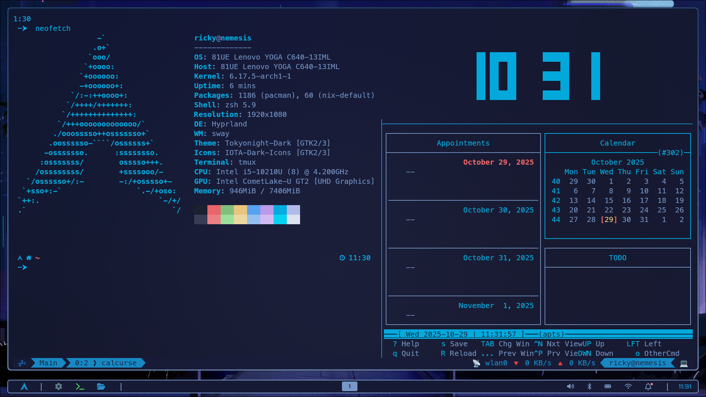

# My Hyprland Setup 🐧📦

### A arch based setup with hyprland as a DE

My definition of a consistent, clean and harmonious DE is to use it without a GUI.
So I decided to only use programs that run via a terminal (with the exception of the browser and the mail client).


The runtime environments and dotfiles are kept very minimalistic and require almost no memory.
This leaves more space and time for the cool stuff :)



---

## 🔧 Features

This setup uses Arch Linux as the basis (but can also work under other distros).
To keep the environment harmonious I use most of the features via Hyprland itself:

- Hyprpaper
- Hypridle
- Hyprlock
- Hyprdock
- Hyprpicker
- gtk-3.0
- qt6ct
- waybar
- Wlogout
- Wofi/Rofi

Take also a look to pkglist.txt in the repo,
which defines all packages related to this setup.

---

## 🚀 Installation & Usage

The best way to use the setup is as follows:

- Clone this repo
- first install the basic setup for Arch Linux (you can use the installation script)
- then install the list pkglist.txt
- move fonts & icons to the appropriate folder for your distro
- move the folder “dotfiles” to your home directory
- change to $HOME/dotfiles
- execute this command:

```
$ stow .
```

You can then fine-tune the settings in the dotfiles according to your wishes

## 📋 Requirements

The repository includes a basic setup based on (Arch), meaning nothing extra needs to be installed.
If you prefer to use a different setup, make sure to install the following packages:

- Kitty (or Alacritty)
- Zsh (incl. OMZ)
- Ly (or greetd & tuigreet)
- Tmux
- Neovim
- gum
- Meslo / Roboto fonts
- Noto Color Emoji (font)

## 🛡️ Safety

I give no guarantee of functionality or compatibility for this setup, so each installation must be checked individually.
I am happy to receive feedback, but can only provide limited support.
Therefore, use this setup at your own risk.

## 📃 License

**MIT** – feel free to fork, improve, and share!
